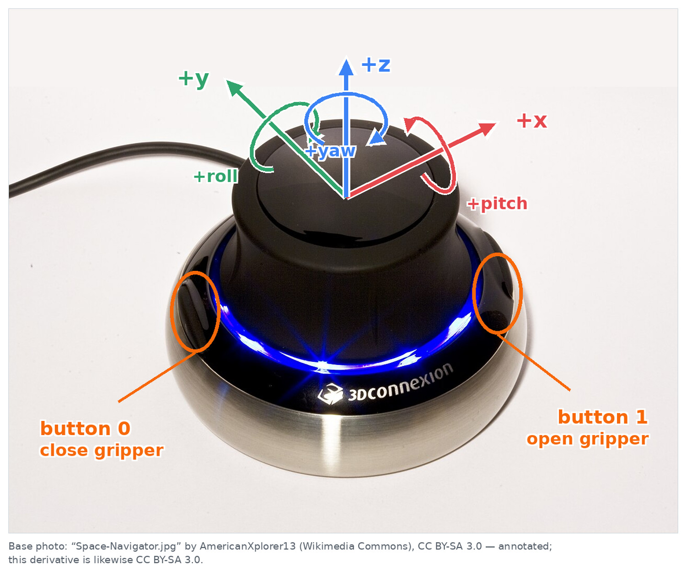

# lerobot-teleoperator-spacemouse

[](https://pypi.org/project/lerobot-teleoperator-spacemouse/)
[](LICENSE)
[](https://pypi.org/project/lerobot-teleoperator-spacemouse/)

A [LeRobot](https://github.com/huggingface/lerobot) plugin that turns a [3Dconnexion SpaceMouse](https://3dconnexion.com/spacemouse) into a 6-DoF robot teleoperator.

Push the puck to move the end-effector in X/Y/Z. Tilt/twist to rotate. Press the side buttons to open or close the gripper. Works out of the box with SO-101 / SO-ARM follower robots via built-in inverse kinematics, and supports any custom URDF through a profile API.




SpaceMouse teleoperation is particularly useful for fine-grained manipulation: its compact form factor and incremental Cartesian input allow precise end-effector adjustments without the workspace and hardware footprint of a conventional leader arm.

---

## Features

- **6-DoF teleoperation** — translation and rotation deltas from SpaceMouse physical axes
- **Virtual leader arm** — the recommended mode: a leader arm the follower never talks back to, so its sag and stick-slip stay out of the command
- **IK mode** — converts end-effector targets to joint commands using LeRobot's `RobotKinematics` and a bundled SO-101 URDF (no calibration file needed)
- **Direct EEF mode** — passes Cartesian targets straight to robots that already accept `ee.*` action keys
- **Native LeRobot recording** — stores processed robot actions with observations and camera frames via `lerobot-record`
- **Gripper control** — left/right buttons open and close the gripper at a configurable speed
- **Axis remapping & sign flip** — remap any physical SpaceMouse axis to any robot axis; flip signs per axis
- **Deadzone & timeout** — configurable deadzone and input-stale timeout prevent drift when the puck is released
- **Workspace clamping** — optional per-axis position limits and max-step rate limiter
- **Custom robot profiles** — register your own URDF + frame + motor list at runtime

---

## Installation

```bash
pip install lerobot-teleoperator-spacemouse
```

LeRobot automatically discovers the installed plugin, so `--teleop.type=spacemouse` is available to
both `lerobot-teleoperate` and `lerobot-record` without a separate recording extra.


SO-101 / SO-ARM IK support is included by default. Other URDF-described robots can be used by providing a custom kinematics profile — see [Extending to Other Robots](#extending-to-other-robots).

---

## Quick Start

### SO-101 follower over USB

```bash
lerobot-teleoperate \
  --robot.type=so101_follower \
  --robot.port=/dev/ttyACM0 \
  --robot.id=my_robot \
  --teleop.type=spacemouse \
  --teleop.adapter.mode=virtual_leader \
  --fps=30
```

See [Virtual Leader Arm](#virtual-leader-arm) for what that mode does and why it is the one to use.

### Record a LeRobot dataset

The recording integration converts SpaceMouse deltas to the robot's native action format before each
frame is written. An SO-101 dataset therefore contains the follower's joint position actions rather than the raw
SpaceMouse axes.

```bash
lerobot-record \
  --robot.type=so101_follower \
  --robot.port=/dev/ttyACM0 \
  --robot.id=my_robot \
  --robot.cameras='{"front": {"type": "opencv", "index_or_path": 0, "width": 640, "height": 480, "fps": 30}}' \
  --teleop.type=spacemouse \
  --teleop.adapter.mode=virtual_leader \
  --dataset.repo_id=my_user/so101_spacemouse \
  --dataset.single_task="Pick up the cube" \
  --dataset.num_episodes=10 \
  --dataset.episode_time_s=30 \
  --dataset.reset_time_s=15 \
  --dataset.fps=30 \
  --dataset.push_to_hub=false \
  --display_data=true
```

Remove `--robot.cameras` for a state-only dataset. 

### Test your SpaceMouse (no robot needed)

```bash
lerobot-teleoperator-spacemouse-test
```

This prints raw SpaceMouse state for 30 seconds so you can verify axes and buttons before connecting a robot.

---

## Virtual Leader Arm

```bash
lerobot-teleoperate \
  --robot.type=so101_follower \
  --robot.port=/dev/ttyACM0 \
  --robot.id=my_robot \
  --teleop.type=spacemouse \
  --teleop.adapter.mode=virtual_leader \
  --robot.max_relative_target=12 \
  --fps=30
```

A leader arm works well because its joint stream is completely independent of the follower: you move the leader, the follower tracks it, and nothing the follower does — sagging, sticking, or lagging — ever feeds back into the command.

The `ik` mode does not have that property. It rebuilds its command from the follower every frame:
forward kinematics on the measured joints, integrate the SpaceMouse delta, inverse kinematics. The
follower's gravity sag therefore feeds back as a downward creep whenever you stop pushing, and its
stick-slip feeds back as command chatter.

`virtual_leader` keeps a virtual arm instead. It reads the follower once, at the first frame, to
start from the real pose. From then on it integrates the SpaceMouse deltas on its own joint state
and streams that; the follower is never read again. With the follower tracking, stuck, or violently
noisy, the commands come out bit-identical.


Non-SO-ARM robots need a URDF here exactly as `ik` mode does — the virtual arm is that URDF:

```bash
lerobot-teleoperate \
  --teleop.type=spacemouse \
  --teleop.adapter.mode=virtual_leader \
  --teleop.adapter.robot_profile=custom \
  --teleop.adapter.urdf_path=/path/to/robot.urdf \
  --teleop.adapter.target_frame_name=gripper_tip \
  --teleop.adapter.motor_names='["joint1","joint2","joint3","joint4","joint5","gripper"]' \
  --teleop.adapter.gripper_name=gripper
```

The virtual arm re-latches onto the follower whenever the processor is reset, which `lerobot-record`
does at the start of every episode.


---

## Configuration Reference

All options are set via `--teleop.<option>` or `--teleop.adapter.<option>` on the command line.

### Teleoperator options (`--teleop.*`)

| Option | Default | Description |
|---|---|---|
| `device` | `None` | Device name or HID device path. Auto-detected when `None`. |
| `deadzone` | `0.08` | Ignore inputs below this fraction of full deflection. |
| `rescale_after_deadzone` | `True` | Rescale remaining range to `[0, 1]` after deadzone. |
| `max_axis_value` | `1.0` | Clamp raw axis values to `[-max, max]`. |
| `input_timeout_s` | `0.08` | Zero-out the axes if no new state arrives within this window (seconds). Buttons are unaffected: the device reports them on change only, so a held button stays active. |
| `read_drain_count` | `32` | Max HID reads per `get_action()` call to drain the queue. |
| `x_axis` | `"y"` | SpaceMouse attribute name mapped to robot `target_x`. |
| `y_axis` | `"x"` | SpaceMouse attribute name mapped to robot `target_y`. |
| `z_axis` | `"z"` | SpaceMouse attribute name mapped to robot `target_z`. |
| `wx_axis` | `"roll"` | SpaceMouse attribute name mapped to robot `target_wx`. |
| `wy_axis` | `"pitch"` | SpaceMouse attribute name mapped to robot `target_wy`. |
| `wz_axis` | `"yaw"` | SpaceMouse attribute name mapped to robot `target_wz`. |
| `x_sign` | `1.0` | Sign multiplier for `target_x`. Use `-1.0` to flip. |
| `y_sign` | `-1.0` | Sign multiplier for `target_y`. |
| `z_sign` | `1.0` | Sign multiplier for `target_z`. |
| `wx_sign` | `1.0` | Sign multiplier for `target_wx`. |
| `wy_sign` | `1.0` | Sign multiplier for `target_wy`. |
| `wz_sign` | `1.0` | Sign multiplier for `target_wz`. |
| `use_gripper` | `True` | Enable gripper button control. |
| `gripper_open_button` | `1` | Button index that opens the gripper. |
| `gripper_close_button` | `0` | Button index that closes the gripper. |
| `require_enable_button` | `False` | Require a dedicated button to enable motion. |
| `enable_button` | `None` | Button index used when `require_enable_button=True`. |
| `idle_enabled` | `False` | Whether `enabled=True` is sent when the device is idle. |

### Adapter options (`--teleop.adapter.*`)

| Option | Default | Description |
|---|---|---|
| `mode` | `"auto"` | `"virtual_leader"`, `"ik"`, `"eef"`, or `"auto"` (uses `"eef"` if the robot exposes `ee.*` keys, else `"ik"`). |
| `robot_profile` | `"so101_follower"` | Built-in kinematics profile. Use `"custom"` to supply your own URDF. |
| `translation_step_m` | `0.002` | End-effector translation per frame at full SpaceMouse deflection (meters). See [Why 2 mm per frame](#why-2-mm-per-frame). |
| `rotation_step_rad` | `0.005` | End-effector rotation per frame at full deflection (radians). |
| `workspace_min` | `None` | `[x, y, z]` lower workspace bound (meters). |
| `workspace_max` | `None` | `[x, y, z]` upper workspace bound (meters). |
| `max_ee_step_m` | `0.02` | Maximum allowed end-effector step per frame (rate limiter). |
| `position_weight` | `1.0` | IK position tracking weight. |
| `orientation_weight` | `0.01` | IK orientation tracking weight. |
| `gripper_speed_factor` | `2.0` | Gripper velocity → position integration scale. |
| `gripper_min` | `0.0` | Gripper position lower bound (normalized joint units). |
| `gripper_max` | `100.0` | Gripper position upper bound (normalized joint units). |
| `max_joint_step_deg` | `8.0` | `virtual_leader`: cap on how far one joint may move per frame. |
| `use_urdf_joint_limits` | `True` | `virtual_leader`: clamp the virtual arm to the URDF's joint limits. |
| `initial_guess_current_joints` | `True` | `ik` mode only. Ignored by `virtual_leader`, which always seeds from the virtual arm. |
| `hold_target_when_idle` | `False` | `ik` mode only. Keeps the target while the puck is idle instead of re-deriving it from the measured pose. `virtual_leader` does this inherently. |
| `max_target_lead_m` | `0.06` | `ik` mode only, with `hold_target_when_idle`. Runaway guard on how far the target may lead the measured pose. |

---

## Linux HID Setup

The SpaceMouse uses the hidraw subsystem. On Linux you need the shared library and a udev rule.

**conda environment:**

```bash
conda install -c conda-forge libhidapi
```

**Debian / Ubuntu system Python:**

```bash
sudo apt-get install libhidapi-hidraw0 libhidapi-dev
```

**udev rule (allows non-root access, optional):**

```bash
sudo tee /etc/udev/rules.d/99-spacemouse-hidraw.rules >/dev/null <<'EOF'
SUBSYSTEM=="hidraw", ATTRS{idVendor}=="256f", MODE="0660", GROUP="plugdev", TAG+="uaccess"
EOF
sudo usermod -aG plugdev "$USER"
sudo udevadm control --reload-rules
sudo udevadm trigger
```

Unplug and replug the SpaceMouse. Log out and back in after the group change.

---

## Extending to Other Robots

### One-off custom URDF

```bash
lerobot-teleoperate \
  --teleop.type=spacemouse \
  --teleop.adapter.mode=ik \
  --teleop.adapter.robot_profile=custom \
  --teleop.adapter.urdf_path=/path/to/robot.urdf \
  --teleop.adapter.target_frame_name=gripper_tip \
  --teleop.adapter.motor_names='["joint1","joint2","joint3","joint4","joint5","gripper"]' \
  --teleop.adapter.gripper_name=gripper
```

### Reusable profile (Python)

Register a profile from your own package and it becomes available as a named `robot_profile`:

```python
from lerobot_teleoperator_spacemouse.profiles import KinematicsProfile, register_kinematics_profile

register_kinematics_profile(
    "my_arm",
    KinematicsProfile(
        urdf_resource=None,           # set urdf_path on the adapter instead
        target_frame_name="tip_link",
        motor_names=("j1", "j2", "j3", "j4", "j5", "gripper"),
        gripper_name="gripper",
    ),
)
```

Then use `--teleop.adapter.robot_profile=my_arm`.

---

## TODO

- [ ] Support SpaceMouse teleoperation during `lerobot-rollout` episodic reset phases.
- [ ] Support SpaceMouse human corrections during `lerobot-rollout --strategy.type=dagger` runs.

Both tasks require the rollout context to use the SpaceMouse action processor so Cartesian deltas are
converted to robot-native actions before commands are sent or correction frames are recorded.


---

## Development

```bash
git clone https://github.com/Jas000n/lerobot-teleoperator-spacemouse.git
cd lerobot-teleoperator-spacemouse
pip install -e ".[dev]"
pytest
```


---

## License

Apache 2.0.
